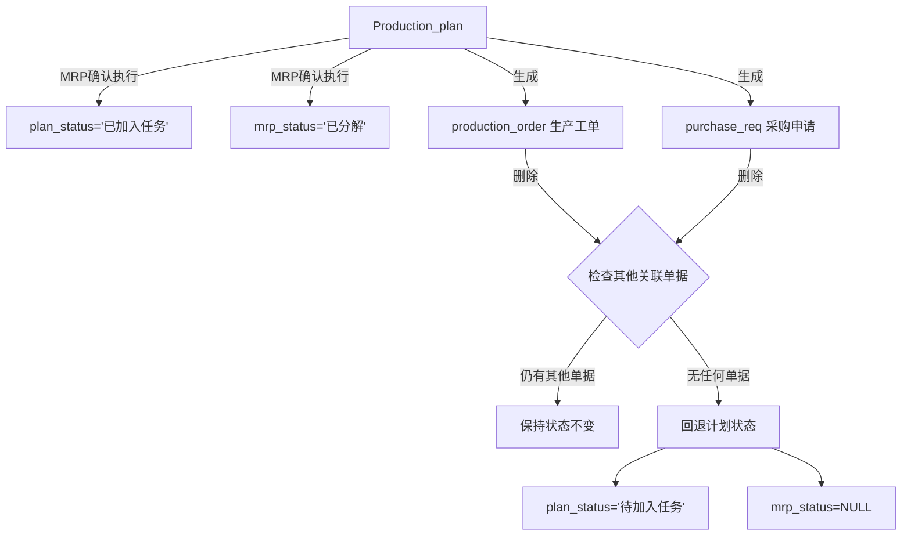
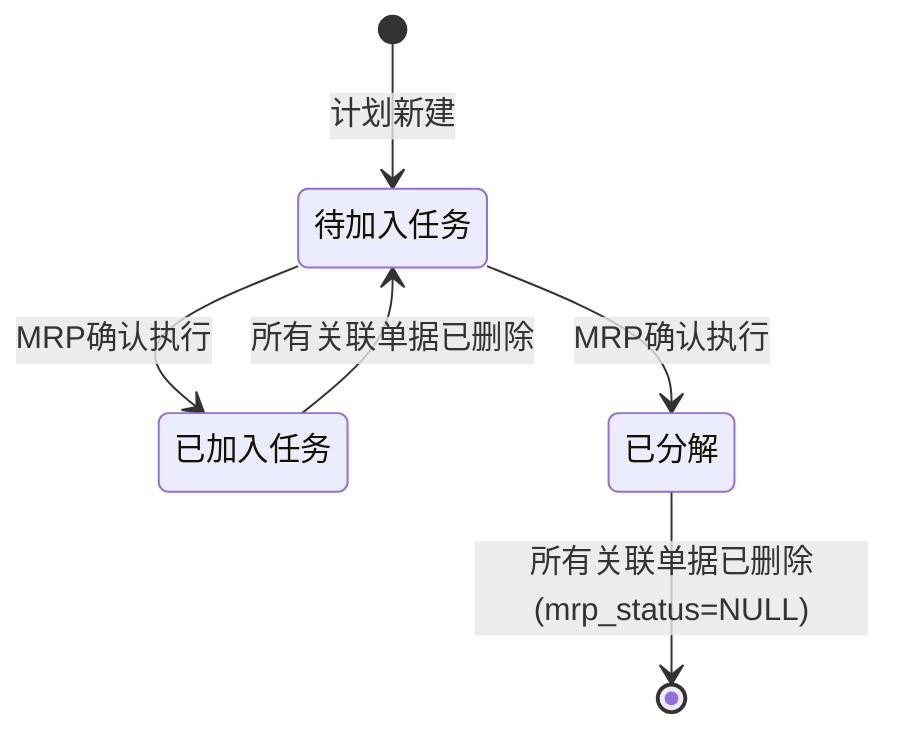

# MRP运行单据删除与生产计划状态回退方案

## 1. 背景与问题

生产计划（Production_plan）经过 MRP 运算并确认执行后，会执行以下操作：

- 更新 `plan_status = N'已加入任务'`
- 更新 `mrp_status = N'已分解'`
- 生成 **生产工单**（production_order，状态：草稿/未开始）
- 生成 **采购申请**（purchase_req，状态：草稿/未执行）

当用户删除这些由 MRP 生成的生产工单或采购申请时，**生产计划的状态参数未能自动回退**，导致该生产计划无法再次参与 MRP 运算（因为 mrp_status 仍为"已分解"），也无法通过计划导入功能重新导入（因为 plan_status 仍为"已加入任务"）。

## 2. 目标

删除 MRP 生成的生产工单或采购申请时，自动检查该生产计划是否还有其他关联的有效单据：

- **有**其他关联单据 → 保持计划状态不变
- **无**任何关联单据 → 回退 `plan_status = N'待加入任务'`、`mrp_status = NULL`

## 3. 业务数据流



### 3.1 计划状态流转图



## 4. 修改点 1：删除生产工单

### 文件

`server/src/modules/production/order/order.controller.ts` — `deleteOrder` 函数（行 220）

### 核心逻辑

```
1. 删除前读取 production_number（关联的生产计划编号）
2. 删除 production_order 记录（保持原有草稿限制）
3. 检查该计划下是否还有其他 production_order（排除自身）
4. 检查该计划下是否还有其他 purchase_req 引用（CHARINDEX 匹配）
5. 两者都无 → 回退 Production_plan
   - plan_status = '待加入任务'
   - mrp_status = NULL
```

### 关键代码

```typescript
// 读取 production_number
const [chk]: any = await sequelize.query(
  `SELECT approval_status, production_number FROM production_order WHERE production_order_number = :id`,
  { replacements: { id } }
);
const productionNumber = chk[0]?.production_number || '';

// 事务内执行删除 + 检查 + 回退
const transaction = await sequelize.transaction();
// 1. 删除生产工单
await sequelize.query(`DELETE FROM production_order WHERE production_order_number = :id`, {
  replacements: { id }, transaction
});

// 2. 检查其他生产单
const [otherOrders]: any = await sequelize.query(
  `SELECT 1 FROM production_order WHERE production_number = :pn AND production_order_number != :id`,
  { replacements: { pn: productionNumber, id }, transaction }
);

// 3. 检查其他采购申请（排除 MRP 临时记录）
const [otherReqs]: any = await sequelize.query(
  `SELECT 1 FROM purchase_req WHERE CHARINDEX(:pn, production_number) > 0 AND purchase_req_number NOT LIKE N'MRP_TEMP%'`,
  { replacements: { pn: productionNumber }, transaction }
);

// 4. 无关联单据 → 回退
if (otherOrders.length === 0 && otherReqs.length === 0) {
  await sequelize.query(
    `UPDATE Production_plan SET plan_status = N'待加入任务', mrp_status = NULL
     WHERE production_number = :pn AND plan_status = N'已加入任务'`,
    { replacements: { pn: productionNumber }, transaction }
  );
}
```

### 注意事项

- **只允许删除草稿状态**的生产工单（已有审批的单据禁止删除，规则不变）
- 事务保护保证删除与状态回退的原子性
- 条件更新 `WHERE plan_status = N'已加入任务'` 防止影响已手动调整的记录

## 5. 修改点 2：删除采购申请

### 文件

`server/src/modules/purchasing/purchaseReq/purchaseReq.controller.ts` — `deletePurchaseReq` 函数（行 244）

### 核心逻辑

```
1. 删除前读取 production_number（逗号分隔，可能关联多个计划）
2. 级联删除 purchase_req_detail + purchase_req
3. 遍历每个关联的生产计划编号：
   a. 检查该计划下是否有 production_order
   b. 检查该计划下是否有其他 purchase_req（排除自身）
   c. 两者都无 → 回退 Production_plan
```

### 关键代码

```typescript
// production_number 为逗号分隔的多值字段，如 "PP-20260429-001,PP-20260429-002"
const productionNumbers = (chk[0]?.production_number || '')
  .split(',').map((s: string) => s.trim()).filter(Boolean);

// 遍历每个关联计划
for (const productionNumber of productionNumbers) {
  const [otherOrders]: any = await sequelize.query(
    `SELECT 1 FROM production_order WHERE production_number = :pn`,
    { replacements: { pn: productionNumber }, transaction }
  );

  const [otherReqs]: any = await sequelize.query(
    `SELECT 1 FROM purchase_req WHERE CHARINDEX(:pn, production_number) > 0
     AND purchase_req_number != :id AND purchase_req_number NOT LIKE N'MRP_TEMP%'`,
    { replacements: { pn: productionNumber, id }, transaction }
  );

  if (otherOrders.length === 0 && otherReqs.length === 0) {
    await sequelize.query(
      `UPDATE Production_plan SET plan_status = N'待加入任务', mrp_status = NULL
       WHERE production_number = :pn AND plan_status = N'已加入任务'`,
      { replacements: { pn: productionNumber }, transaction }
    );
  }
}
```

### 注意事项

- 采购申请的 `production_number` 字段为 **逗号分隔的多值字段**（一个采购申请可能对应多个生产计划）
- 需要遍历每个计划编号逐一检查
- 排除自身及 MRP 临时记录（`MRP_TEMP%`）

## 6. MRP 执行端的状态变更（原有逻辑不变）

### 文件

`server/src/modules/planning/mrp/mrp.controller.ts`（行 857-927）

### MRP 确认执行时

```sql
-- 更新 mrp_status
UPDATE Production_plan SET mrp_status = N'已分解'
WHERE production_number IN (SELECT DISTINCT production_number FROM mrp_run_plan WHERE mrp_run_number = :mrp_run_number)
  AND mrp_status IS NULL;

-- 生成生产工单（INSERT INTO production_order）
-- 生成采购申请（INSERT INTO purchase_req + detail）

-- 更新 plan_status
UPDATE Production_plan SET plan_status = N'已加入任务'
WHERE production_number IN (SELECT DISTINCT production_number FROM mrp_run_plan WHERE mrp_run_number = :mrp_run_number)
  AND plan_status = N'待加入任务';
```

## 7. 状态兼容性矩阵

| 操作 | 条件 | plan_status | mrp_status | 说明 |
|------|------|------------|------------|------|
| MRP 确认执行 | 计划状态=待加入任务 | `已加入任务` | `已分解` | 原有逻辑 |
| 删除生产工单 | 无其他关联单据 | `待加入任务` | `NULL` | 新增回退 |
| 删除采购申请 | 无其他关联单据 | `待加入任务` | `NULL` | 新增回退 |
| 删除生产工单 | 还有其他关联单据 | 不变 | 不变 | 新增判断 |
| 删除采购申请 | 还有其他关联单据 | 不变 | 不变 | 新增判断 |
| 手动修改计划状态 | 任意 | 按用户设置 | 按用户设置 | 不受影响 |

## 8. 安全设计

1. **交叉引用检查**：删除生产工单时检查采购申请是否存在引用，反之亦然，确保不残留悬空状态
2. **事务原子性**：删除记录 + 状态回退在同一个数据库事务中，避免部分失败导致数据不一致
3. **条件更新保护**：`WHERE plan_status = N'已加入任务'` 防止错误回退已手动调整的记录
4. **草稿校验保留**：仅允许删除草稿状态的单据，保持原有审批流程约束

## 9. 测试要点

| # | 场景 | 预期结果 |
|---|------|----------|
| 1 | MRP 执行后生成 1 个生产单 + 1 个采购申请，分别删除两者 | 第一次删除 → 仍有另一单据 → 不回退；第二次删除 → 无关联单据 → 回退 |
| 2 | MRP 执行后生成 2 个生产单 + 0 个采购申请，删除 1 个 | 仍有 1 个生产单 → 不回退 |
| 3 | 采购申请 production_number 包含 2 个计划编号，删除后只回退无其他单据的计划 | 按计划编号分别检查并回退 |
| 4 | 删除非 MRP 来源的生产工单（production_number 为空） | 跳过回退检查，正常删除 |
| 5 | 事务中回退失败（如数据库异常） | 事务回滚，删除也撤销，保持一致性 |
