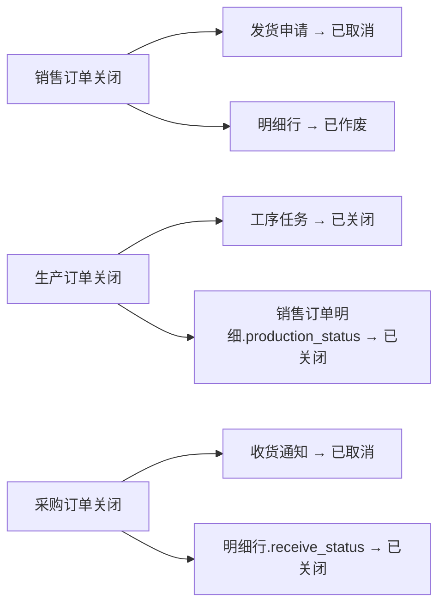
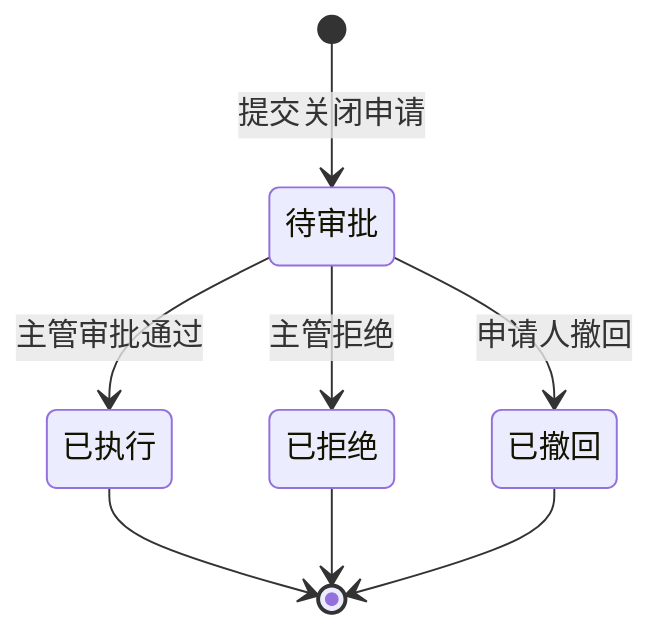

# 批量关闭订单 — 操作手册

## 一、业务概述

销售订单、生产订单、采购订单在正常业务流程中，满足条件时可由系统**自动完成关闭**（通过单据自动完成配置）。但部分订单因异常情况无法满足自动完成条件（如发货中断、生产未完成、收货逾期等），需由操作人员**手动发起关闭申请**，经主管审批后执行关闭。

批量关闭功能支持：

- 在各订单列表页**批量选择**待关闭单据
- 自动**检测异常**并分类提示（发货异常、生产异常、质量异常等）
- 选择关闭原因并填写备注后**提交审批**
- 主管在"关闭审批"页面**审批通过或拒绝**
- 审批通过后**自动执行关闭**并**级联关闭**下游关联单据

## 二、适用范围

| 单据类型 | 入口页面 | 关闭后状态 |
|----------|----------|------------|
| 销售订单 | 销售管理 → 销售订单列表 | 订单状态 → 已取消 |
| 生产订单 | 生产管理 → 生产订单列表 | 完成状态 → 已关闭，计划状态 → 已关闭 |
| 采购订单 | 采购管理 → 采购订单列表 | 订单状态 → 已关闭 |

## 三、前置条件

| 条件 | 说明 |
|------|------|
| 订单审批状态 | **已审批**（未审批的订单不可关闭） |
| 订单当前状态 | 非"已完成"、非"已取消/已关闭" |
| 操作权限 | 需拥有对应模块的批量关闭权限 |
| 审批权限 | 主管需拥有"关闭审批"页面权限 |

## 四、关闭原因分类

### 销售订单关闭原因

| 编码 | 原因 | 说明 |
|------|------|------|
| SO_SHIP | 发货异常 | 部分/无法发货 |
| SO_PROD | 生产异常 | 生产未完成/中断 |
| SO_RETURN | 退货异常 | 退货处理中 |
| SO_OTHER | 其他原因 | 客户取消/商务决策 |

### 生产订单关闭原因

| 编码 | 原因 | 说明 |
|------|------|------|
| PO_EXEC | 执行异常 | 生产中断/工序卡住 |
| PO_INBOUND | 入库异常 | 未入库/部分入库 |
| PO_QUALITY | 质量异常 | 检验不合格/返修 |
| PO_OTHER | 其他原因 | 计划取消/工艺变更 |

### 采购订单关闭原因

| 编码 | 原因 | 说明 |
|------|------|------|
| PUR_RECV | 收货异常 | 未到货/部分到货/逾期 |
| PUR_QUALITY | 质量异常 | 检验不合格/待检 |
| PUR_OTHER | 其他原因 | 供应商放弃/商务取消 |

## 五、操作步骤

### 5.1 操作员：发起批量关闭

#### 步骤 1：进入订单列表页

导航至对应的订单列表页（销售订单 / 生产订单 / 采购订单）。

#### 步骤 2：选择待关闭订单

- 在列表中勾选需要关闭的订单（支持跨页选择）
- 点击工具栏中的 **"批量关闭"** 按钮

#### 步骤 3：查看异常检测结果

弹窗打开后，系统自动检测所选订单的异常情况，展示结果表：

| 列 | 说明 |
|----|------|
| 单据编号 | 订单号 |
| 状态 | "可关闭"（绿色）或"不可关闭"（红色） |
| 异常分类 | 检测到的异常类型标签，如"发货异常: 3行未完成发货" |
| 级联影响 | 关闭后将影响的下游单据及数量 |

> 不可关闭的订单会显示原因（如"订单已完成""订单未审批"等），不会进入后续关闭流程。

#### 步骤 4：选择关闭原因并提交

1. 确认可关闭的订单后，点击 **"下一步"**
2. 在关闭原因下拉框中选择合适的关闭原因（必填）
3. 在备注框中填写关闭说明（选填）
4. 确认影响范围提示信息
5. 点击 **"提交关闭申请"**

#### 步骤 5：查看提交结果

系统显示提交结果：
- 成功条数及订单号
- 失败条数及失败原因（如有）

提交成功的订单进入 **"待审批"** 状态，需等待主管审批。

### 5.2 主管：审批关闭申请

#### 步骤 1：进入关闭审批页面

导航至 **系统管理 → 关闭审批**，打开待审批列表。

#### 步骤 2：查看申请详情

- 页面以折叠面板展示各批次申请
- 每个面板显示：批次号、单据类型、申请人、申请时间
- 展开面板可查看涉及的单据编号和异常分类

#### 步骤 3：审批操作

- **审批通过**：点击"审批通过并执行关闭"按钮，系统确认后立即执行关闭及级联操作
- **拒绝**：点击"拒绝"按钮，该批次所有申请被拒绝

## 六、关闭后数据变化

### 6.1 销售订单关闭

| 对象 | 字段变化 |
|------|----------|
| 主表 | `order_status` → 已取消 |
| 主表 | `close_reason` ← 关闭原因编码 |
| 主表 | `close_remark` ← 关闭备注 |
| 主表 | `force_closed_by` ← 操作人 |
| 主表 | `force_closed_date` ← 关闭时间 |
| 明细行 | `status` → 已作废（非已完成/已作废的行） |

### 6.2 生产订单关闭

| 对象 | 字段变化 |
|------|----------|
| 主表 | `completion_status` → 已关闭，`plan_status` → 已关闭 |
| 主表 | `close_reason` / `close_remark` / `force_closed_by` / `force_closed_date` |
| 工序任务 | `task_status` → 已关闭（未完成/未关闭的工序） |
| 销售订单明细 | `production_status` → 已关闭（关联行） |

### 6.3 采购订单关闭

| 对象 | 字段变化 |
|------|----------|
| 主表 | `order_status` → 已关闭 |
| 主表 | `close_reason` / `close_remark` / `force_closed_by` / `force_closed_date` |
| 明细行 | `receive_status` → 已关闭（未到货的行） |

## 七、级联关闭规则

关闭订单时，系统自动处理下游关联单据：

| 上游关闭 | 下游单据 | 级联操作 | 条件 |
|----------|----------|----------|------|
| 销售订单 | 发货申请 | 状态 → 已取消 | 未发货、未取消的申请 |
| 生产订单 | 工序任务 | 状态 → 已关闭 | 未完成、未关闭的任务 |
| 生产订单 | 销售订单明细 | production_status → 已关闭 | 非生产完成/已关闭的关联行 |
| 采购订单 | 收货通知 | approval_status → 已取消 | 待确认的收货通知 |

## 八、审批状态流转

## 九、注意事项

1. **关闭不可逆**：审批通过后立即执行关闭，操作不可撤销，请务必确认后再审批
2. **级联影响**：关闭生产订单会同步关闭工序任务并回写销售订单明细的生产状态，关闭前请确认下游影响
3. **仅已审批订单可关闭**：草稿或未审批的订单不支持手动关闭，请先完成审批或使用其他方式处理
4. **已完成/已取消订单不可重复关闭**：系统会自动跳过这些订单
5. **批次号规则**：每次批量提交生成一个批次号（格式 `MC-YYYYMMDD-NNN`），同一批次的申请一起审批
6. **审批粒度**：审批以批次为单位，通过则整批执行，拒绝则整批拒绝
7. **部分失败处理**：审批通过后，如果某条订单执行关闭失败，不影响同批次其他订单的关闭

## 十、常见问题

### Q1：点击"批量关闭"后提示无可关闭单据？

- 检查所选订单是否已审批（审批状态为"已审批"）
- 检查订单是否已处于"已完成"或"已取消/已关闭"状态
- 确认是否已选中订单（列表需勾选复选框）

### Q2：异常检测显示"不可关闭"？

- 订单未审批：需先完成审批流程
- 订单已完成：无需再关闭
- 订单已取消/已关闭：不可重复操作

### Q3：关闭申请提交后多久可以审批？

- 提交后立即出现在"关闭审批"页面，主管可即时审批

### Q4：审批通过后可以撤回吗？

- 审批通过后立即执行关闭，不可撤回
- 待审批状态的申请，原提交人可在审批页面撤回

### Q5：如何查看已关闭订单的关闭原因？

- 在订单详情中可查看 `close_reason`（关闭原因）和 `close_remark`（关闭备注）字段
- 也可在 `manual_close_log` 表中查询完整审批记录

### Q6：批量关闭是否支持跨类型（如同时关闭销售订单和生产订单）？

- 不支持。每种订单类型需在各自列表页单独操作，原因选项和级联规则各不相同
