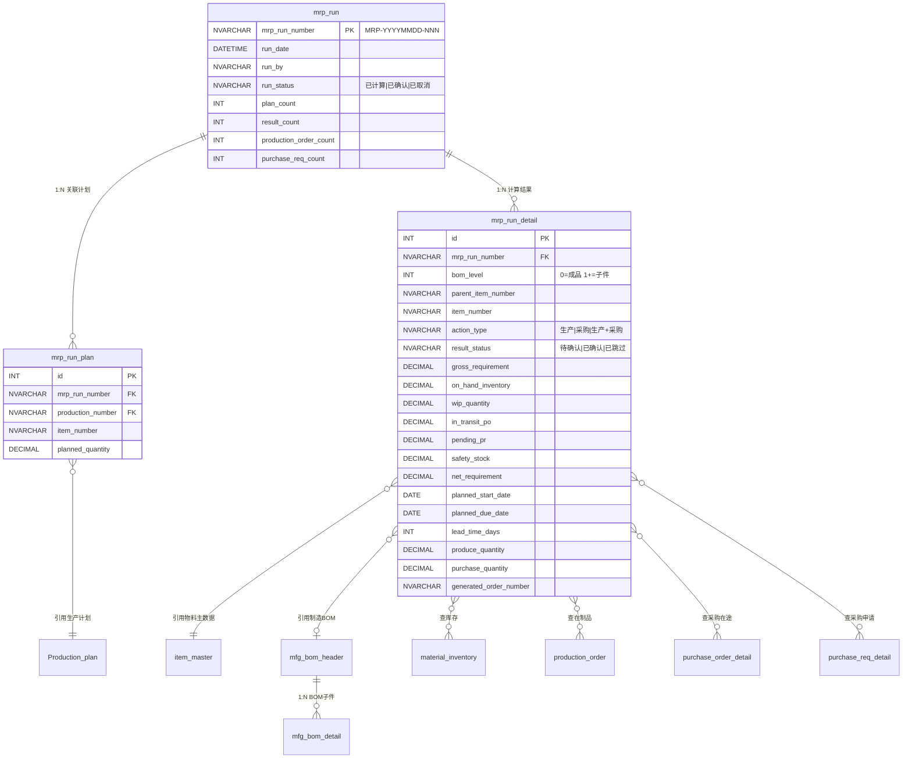
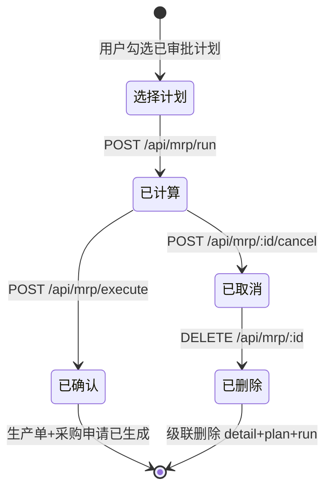
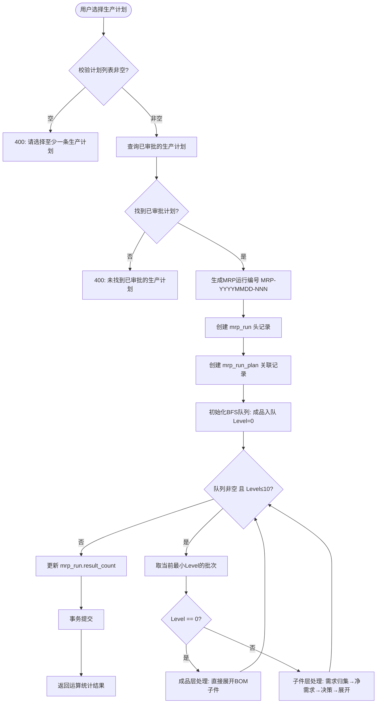
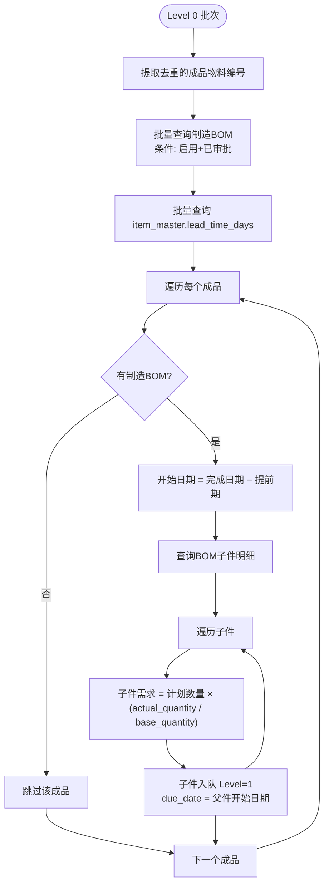
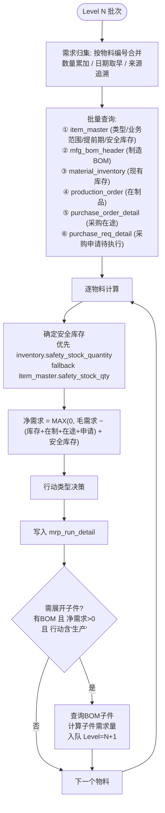
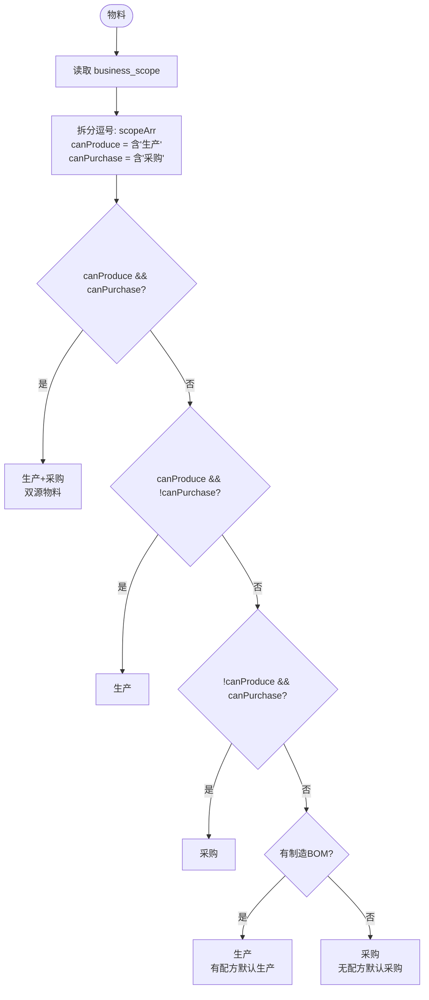
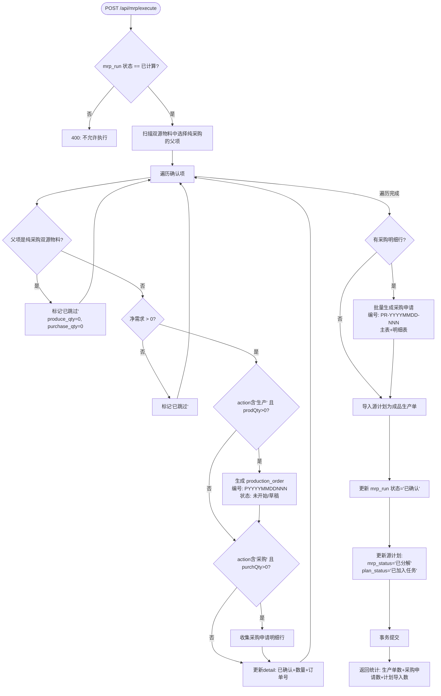
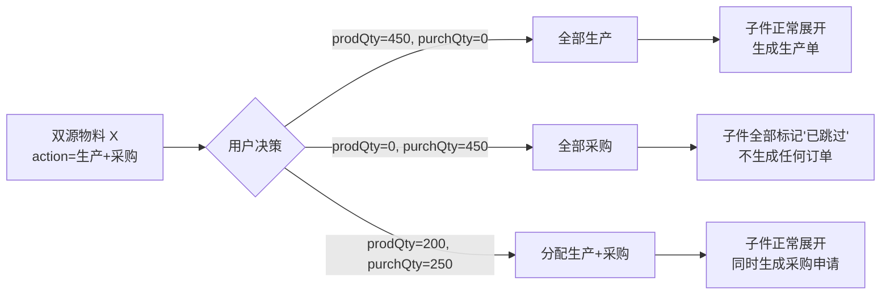
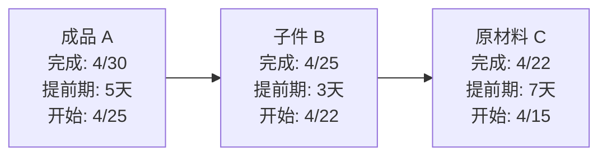

# 计划管理 — MRP 运算逻辑流程图

> 基于代码分析自动生成，源码：`server/src/modules/planning/mrp/mrp.controller.ts`（1009 行）

---

## 一、核心公式

```
净需求 = MAX(0, 毛需求 − 可用供应 + 安全库存)

可用供应 = 现有库存 + 在制品数量 + 采购在途 + 采购申请待执行

子件需求量 = 父件净需求 × (BOM子件实际用量 / BOM基准数量)

开始日期 = 完成日期 − 提前期天数
```

---

## 二、ER 数据模型



---

## 三、MRP 运行生命周期状态机



| 状态 | 可执行操作 | 说明 |
|------|----------|------|
| 已计算 | 执行 / 取消 | BOM分解完成，等待用户审查双源物料分配 |
| 已确认 | 无（终态） | 已生成生产单和采购申请 |
| 已取消 | 删除 | 仅已取消状态可删除 |

---

## 四、MRP 运算核心流程（广度优先 BOM 分解）



---

## 五、成品层处理流程（Level 0）



**关键规则**：
- 成品层 **不做净需求计算**（需求已由 MPS 主计划确定）
- 仅展开 BOM 子件，将子件需求传递到 Level 1

---

## 六、子件层处理流程（Level 1+）



---

## 七、行动类型决策逻辑



| 优先级 | 条件 | 结果 |
|-------|------|------|
| 1 | 业务范围同时含「生产」和「采购」 | **生产+采购**（双源） |
| 2 | 仅含「生产」 | **生产** |
| 3 | 仅含「采购」 | **采购** |
| 4 | 空/NULL + 有制造BOM | **生产** |
| 5 | 空/NULL + 无制造BOM | **采购** |

---

## 八、净需求计算示例

### 8.1 供应数据来源

| 数据项 | 来源表 | SQL 条件 |
|--------|--------|---------|
| 现有库存 | `material_inventory` | `SUM(quantity) WHERE item_number = :x` |
| 安全库存 | `material_inventory` / `item_master` | 优先 `safety_stock_quantity`; fallback `safety_stock_qty` |
| 在制品 | `production_order` | `approval_status='已审批' AND plan_status NOT IN ('已完成','已关闭')` |
| 采购在途 | `purchase_order_detail` JOIN `purchase_order` | `SUM(order_qty - received_qty) WHERE approval_status='已审批'` |
| 采购待执行 | `purchase_req_detail` JOIN `purchase_req` | `SUM(request_qty - ordered_qty) WHERE approval_status='已审批' AND status='未执行'` |

### 8.2 计算示例

| 项目 | 物料 A | 物料 B |
|------|--------|--------|
| 毛需求 | 1000 | 500 |
| 现有库存 | 200 | 300 |
| 在制品 | 300 | 200 |
| 采购在途 | 100 | 50 |
| 采购待执行 | 50 | 0 |
| **可用供应** | **650** | **550** |
| 安全库存 | 100 | 0 |
| **净需求** | MAX(0, 1000−650+100) = **450** | MAX(0, 500−550+0) = **0** |

物料 B 净需求为 0，**不展开其 BOM 子件**。

---

## 九、MRP 执行流程（生成生产单 + 采购申请）



---

## 十、双源物料特殊处理



**核心规则**：当双源物料选择**纯采购**（produce_quantity = 0）时，其所有 BOM 子项自动跳过。

---

## 十一、提前期逐层倒推



规则：**子件完成日期 = 父件开始日期**，逐层向前递推。

---

## 十二、BOM 展开条件与深度控制

| 条件 | 要求 | 不满足时 |
|------|------|---------|
| 有制造 BOM | `mfg_bom_header` 存在且启用+已审批 | 不展开 |
| 净需求 > 0 | 计算结果为正值 | 不展开（库存充足） |
| 行动类型含「生产」 | `action_type` 为「生产」或「生产+采购」 | 不展开（纯采购） |
| BOM 层级 ≤ 10 | `maxDepth = 10` | 停止展开（防无限递归） |

---

## 十三、编号生成规则

| 编号类型 | 格式 | 示例 |
|---------|------|------|
| MRP 运行 | `MRP-YYYYMMDD-NNN` | MRP-20260423-001 |
| 生产单 | `PYYYYMMDDNNN` | P20260423001 |
| 采购申请 | `PR-YYYYMMDD-NNN` | PR-20260423-001 |

序号取当日最大值 +1，3 位补零。

---

## 十四、API 接口清单

| 方法 | 路径 | 函数 | 说明 |
|------|------|------|------|
| GET | `/api/mrp/plans-for-mrp` | `getPlansForMrp` | 获取可MRP的计划列表（已审批+待加入任务+未分解） |
| POST | `/api/mrp/run` | `runMRP` | 运行MRP计算（核心引擎） |
| GET | `/api/mrp` | `getMRPRuns` | MRP运行记录列表（分页） |
| GET | `/api/mrp/:id` | `getMRPRunDetail` | MRP运行详情（头+计划+明细+统计） |
| POST | `/api/mrp/execute` | `executeMRP` | 确认执行（生成生产单+采购申请） |
| POST | `/api/mrp/:id/cancel` | `cancelMRPRun` | 取消MRP运行（仅已计算可取消） |
| DELETE | `/api/mrp/:id` | `deleteMRPRun` | 删除MRP运行（仅已取消可删除） |

---

## 十五、关键数据库表

| 表名 | 用途 | 关键字段 |
|------|------|---------|
| `mrp_run` | MRP运行主表 | mrp_run_number, run_status, plan_count |
| `mrp_run_plan` | 运行关联计划 | mrp_run_number, production_number |
| `mrp_run_detail` | 计算结果明细 | bom_level, gross/net_requirement, action_type |
| `Production_plan` | 生产计划（输入源） | approval_status, plan_status, mrp_status |
| `mfg_bom_header` | 制造BOM主表 | item_number, base_quantity, condition |
| `mfg_bom_detail` | 制造BOM明细 | material_number, actual_quantity |
| `item_master` | 物料主数据 | business_scope, lead_time_days, safety_stock_* |
| `material_inventory` | 原材料库存 | quantity, safety_stock_quantity |
| `production_order` | 生产单（在制品/输出） | planned_quantity, plan_status |
| `purchase_order_detail` | 采购订单明细（在途） | order_quantity, received_quantity |
| `purchase_req` / `_detail` | 采购申请（输出） | request_quantity, ordered_quantity |

---

## 十六、关键代码位置

| 功能 | 文件 | 行号 |
|------|------|------|
| 编号生成工具 | `mrp.controller.ts` | L7-70 |
| 计划筛选查询 | `mrp.controller.ts` | L86-122 |
| **MRP核心引擎** | `mrp.controller.ts` | L126-535 |
| ├ BFS初始化 | `mrp.controller.ts` | L186-211 |
| ├ Level 0成品层 | `mrp.controller.ts` | L225-284 |
| ├ Level 1+需求归集 | `mrp.controller.ts` | L289-319 |
| ├ 批量查询供应数据 | `mrp.controller.ts` | L324-393 |
| ├ 净需求计算 | `mrp.controller.ts` | L396-415 |
| ├ 行动类型决策 | `mrp.controller.ts` | L418-433 |
| └ BOM子件展开 | `mrp.controller.ts` | L487-510 |
| **MRP执行（生成订单）** | `mrp.controller.ts` | L624-942 |
| ├ 双源决策跳过子项 | `mrp.controller.ts` | L652-691 |
| ├ 生成生产单 | `mrp.controller.ts` | L709-737 |
| ├ 生成采购申请 | `mrp.controller.ts` | L776-842 |
| └ 源计划状态回写 | `mrp.controller.ts` | L856-926 |
| 路由注册 | `mrp.routes.ts` | L16-22 |
| SQL建表脚本 | `mrp_migration.sql` | L1-94 |

