# 销售管理 — 从订单到发货到退货全流程方案

> 基于现有代码分析 + 缺失环节补充设计

---

## 一、全局流程总览

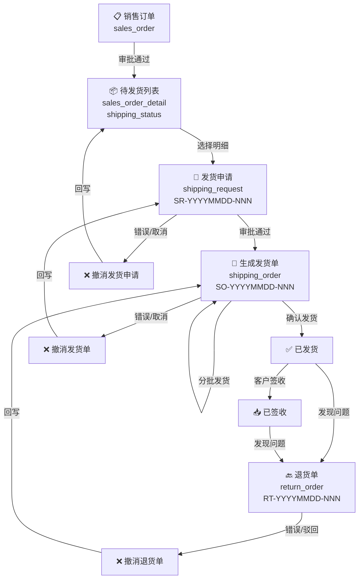

---

## 二、各单据编号规则

| 单据 | 编号格式 | 示例 |
|------|---------|------|
| 销售订单 | `SO-YYYYMMDD-NNN` | SO-20260423-001 |
| 发货申请 | `SR-YYYYMMDD-NNN` | SR-20260423-001 |
| 发货单 | `SO-YYYYMMDD-NNN` | SO-20260423-001 |
| 退货单 | `RT-YYYYMMDD-NNN` | RT-20260423-001 |

---

## 三、数据模型（ER 图）

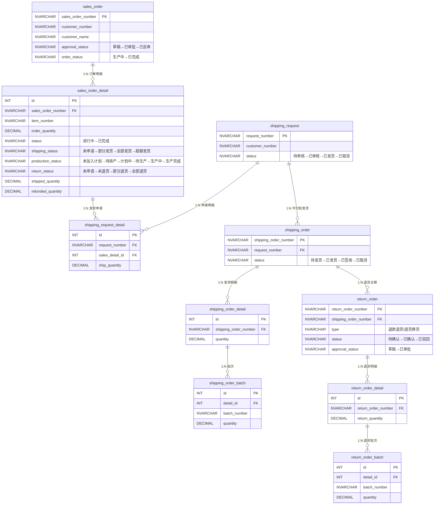

---

## 四、阶段一：销售订单下达与审批

### 4.1 状态流转

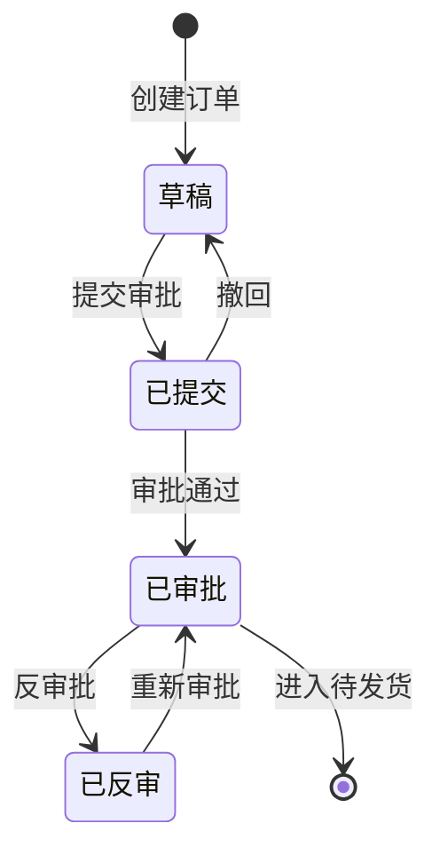

### 4.2 流程

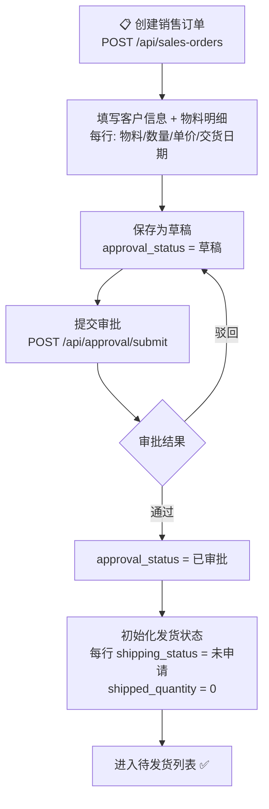

### 4.3 现有实现

| 功能 | 文件 | 说明 |
|------|------|------|
| 订单 CRUD | `salesOrder.controller.ts` (858行) | 完整 |
| 审批流程 | `approval.controller.ts` | 通用审批模块 |
| 状态字段 | `sales_order.approval_status` | 草稿 / 已审批 |
| 发货跟踪 | `sales_order_detail.shipping_status` | 未申请 / 部分发货 / 全部发货 |

---

## 五、阶段二：待发货 → 生成发货申请

### 5.1 待发货数量计算

```
待发数量 = MAX(0, order_quantity - refunded_quantity - shipped_quantity)
建议发货量 = MAX(0, order_quantity - refunded_quantity - shipped_quantity - applied_quantity)
```

### 5.2 流程

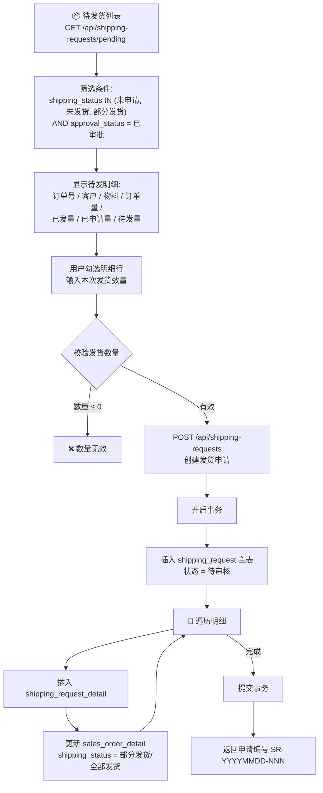

### 5.3 发货申请状态机

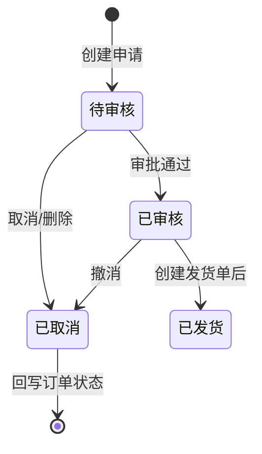

| 状态 | 可执行操作 | 限制 |
|------|----------|------|
| 待审核 | 编辑 / 删除 / 提交审批 | 仅创建者可操作 |
| 已审核 | 创建发货单 / 撤消 | 撤消需回写订单发货状态 |
| 已发货 | 无（终态） | 已生成发货单 |
| 已取消 | 无（终态） | 已回写订单发货状态 |

---

## 六、阶段三：发货申请 → 生成发货单（支持分批）

### 6.1 核心设计：一个申请可多次分批发货

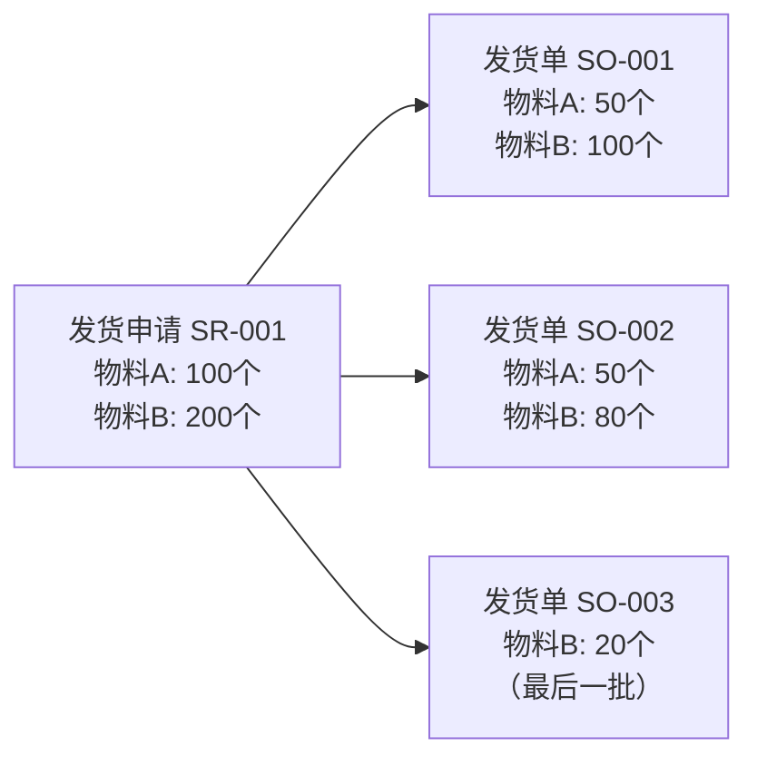

### 6.2 发货单创建流程

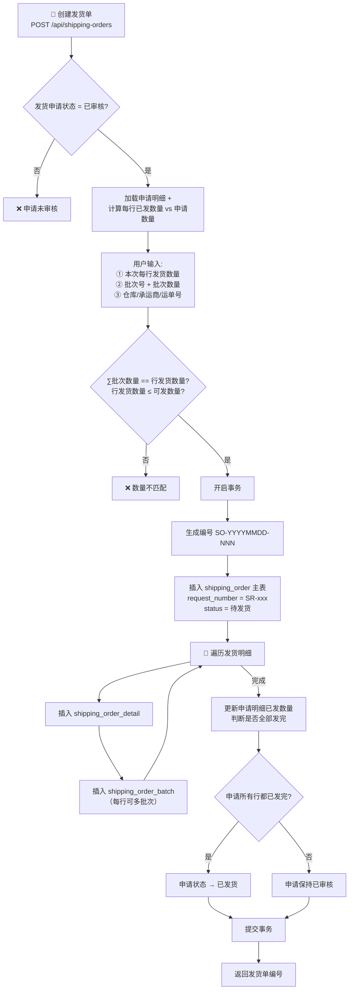

### 6.3 发货单状态机

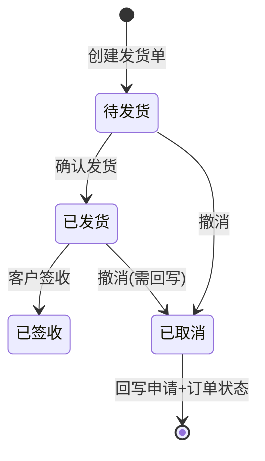

| 状态 | 可执行操作 | 说明 |
|------|----------|------|
| 待发货 | 更新物流信息 / 确认发货 / 撤消 | 可修改承运商/运单号/收货地址 |
| 已发货 | 签收确认 / 撤消 | 撤消需回写申请已发数量 |
| 已签收 | 查看 / 打印 | 终态，仅可发起退货 |
| 已取消 | 无 | 终态 |

---

## 七、阶段四：退货管理

### 7.1 退货前提

```
退货条件: 发货单状态 IN ('已发货', '已签收')
可退数量 = 发货批次数量 - ∑已退数量(排除已驳回)
```

### 7.2 退货流程

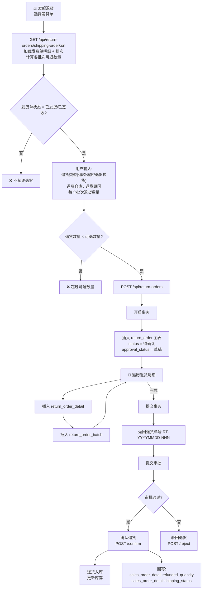

### 7.3 退货单状态机

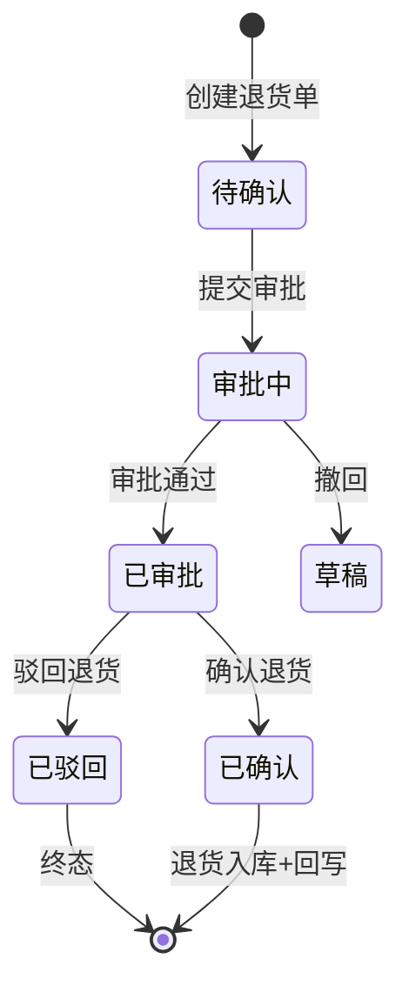

| 状态 | approval_status | 可执行操作 |
|------|----------------|----------|
| 待确认 | 草稿 | 编辑 / 删除 / 提交审批 |
| 审批中 | 已提交 | 审批 / 撤回 |
| 已审批 | 已审批 | 确认 / 驳回 |
| 已确认 | 已审批 | 无（终态） |
| 已驳回 | 已审批 | 无（终态） |

---

## 八、撤消/删除 — 回写逻辑

### 8.1 撤消发货申请

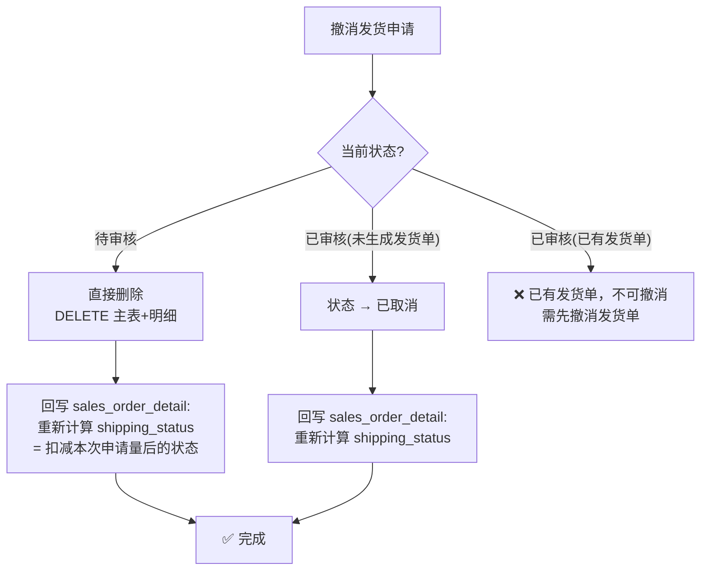

**回写公式：**
```
当前已申请总量 = ∑(所有非取消申请的 ship_quantity)
if (已申请总量 == 0) shipping_status = '未申请'
else if (已申请总量 < order_quantity) shipping_status = '部分发货'  
else shipping_status = '全部发货'
```

### 8.2 撤消发货单

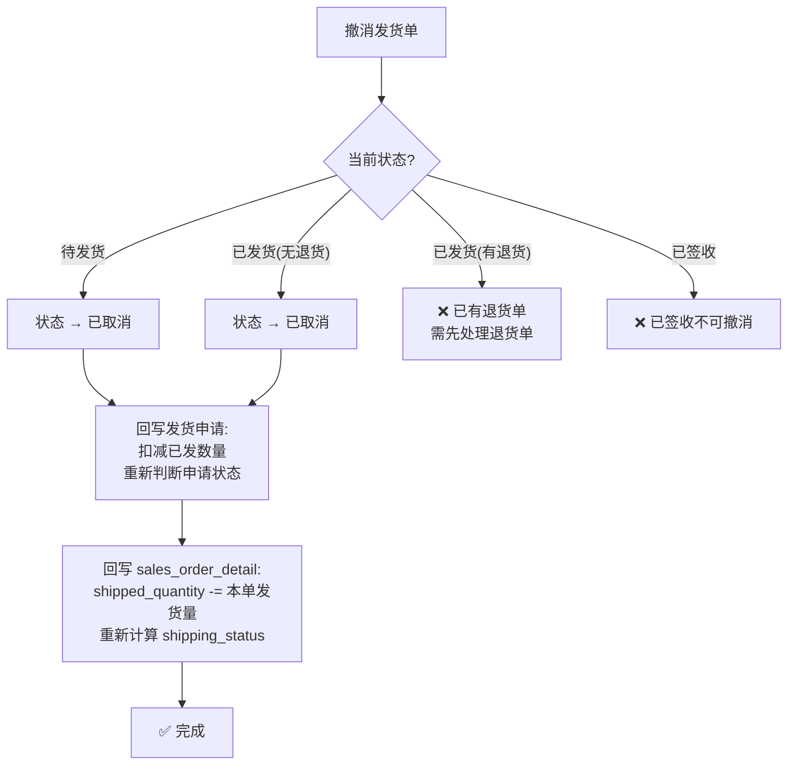

### 8.3 撤消/驳回退货单

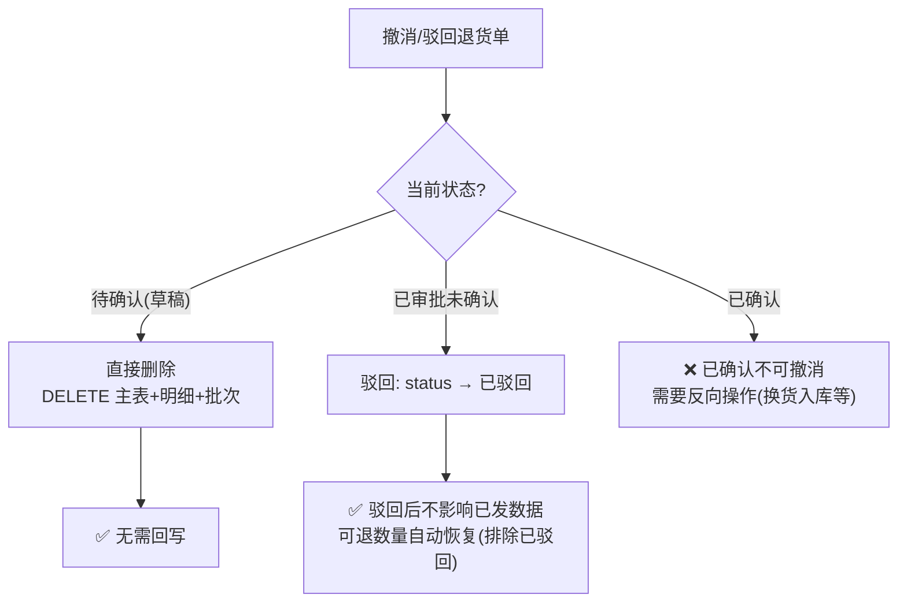

---

## 九、核心量级关系

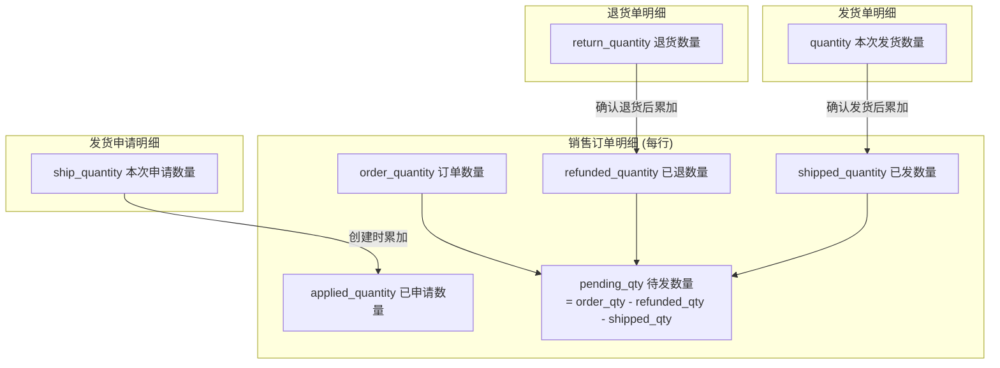

**关键不变式：**
```
shipped_quantity = ∑(所有已确认发货单的发货数量)
refunded_quantity = ∑(所有已确认退货单的退货数量)  
实际净发 = shipped_quantity - refunded_quantity
```

---

## 十、完整端到端时序图

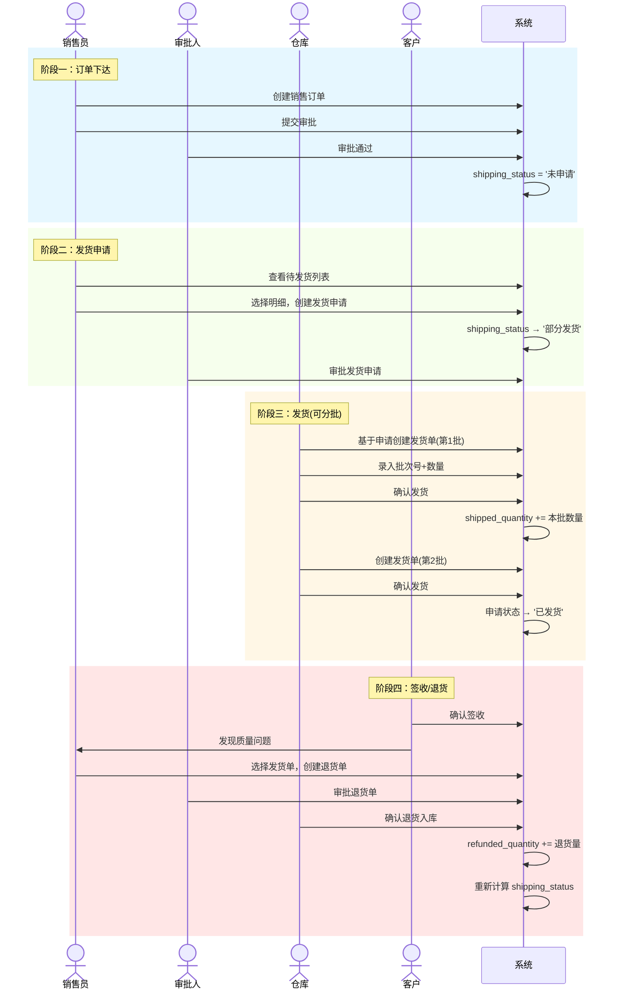

---

## 十一、现有实现 vs 待开发

### 11.1 已实现（✅）

| 模块 | 文件 | 行数 | 功能 |
|------|------|------|------|
| 销售订单 | `salesOrder.controller.ts` | 858 | 完整 CRUD + 审批 |
| 发货申请 | `shippingRequest.controller.ts` | 437 | 待发货列表 / 创建申请 / 更新 / 删除 / 状态变更 |
| 发货单 | `shippingOrder.controller.ts` | 296 | 列表 / 详情 / 物流更新 / 状态更新 / 打印 |
| 退货单 | `returnOrder.controller.ts` | 629 | 完整 CRUD + 确认 / 驳回 + 可退数量计算 |

### 11.2 已完成开发（原待开发清单）

| 功能 | 优先级 | 说明 | 状态 |
|------|--------|------|------|
| **发货单创建 API** | P0 | `POST /api/shipping-orders` 创建接口，含 UPDLOCK 防并发超发 | ✅ 已完成 |
| **发货申请撤消回写** | P0 | 撤消已审核申请时回写 `shipping_status`（统一实发净量+申请量逻辑） | ✅ 已完成 |
| **发货单撤消回写** | P0 | 撤消发货单两层回写：`shipped_quantity` / `delivered_quantity` 扣减 + 申请状态回退 | ✅ 已完成 |
| **退货确认回写** | P1 | 确认退货后回写 `refunded_quantity`，按净发量重算 `shipping_status` | ✅ 已完成 |
| 发货申请 → 发货单关联 | P1 | `shipping_order` 增加 `request_number` 字段（迁移脚本 042） | ✅ 已完成 |
| 发货单已发数量追踪 | P1 | `shipping_request_detail` 增加 `delivered_quantity`，创建/撤消时自动维护 | ✅ 已完成 |
| 退货入库联动 | P2 | 确认退货后自动调用 `returnInboundService` 生成退货入库单（容错设计） | ✅ 已完成 |
| **退货状态联动** | P3 | 退货确认后自动计算 `return_status`（未申请/未退货/部分退货/全部退货） | ✅ 已完成 |
| **生产状态全链路** | P3 | `production_status` 6态单向递进：未加入计划→待排产→计划中→待生产→生产中→生产完成 | ✅ 已完成 |
| **行状态自动完成** | P3 | 全部发货/超额发货 → `status = 已完成`，回退 → `进行中` | ✅ 已完成 |
| **订单头状态汇总** | P3 | 全部行已完成 → `order_status = 已完成`，行回退 → `生产中` | ✅ 已完成 |
| **状态闭环迁移脚本** | P3 | `043_sales_status_sync.ts` 历史数据回填（5步：重命名+return_status+行状态+production_status+订单头） | ✅ 已完成 |

---

## 十二、API 接口清单

### 12.1 销售订单

| 方法 | 路径 | 说明 | 状态 |
|------|------|------|------|
| GET | `/api/sales-orders` | 订单列表 | ✅ |
| POST | `/api/sales-orders` | 创建订单 | ✅ |
| GET | `/api/sales-orders/:id` | 订单详情 | ✅ |
| PUT | `/api/sales-orders/:id` | 更新订单 | ✅ |
| DELETE | `/api/sales-orders/:id` | 删除订单 | ✅ |

### 12.2 发货申请

| 方法 | 路径 | 说明 | 状态 |
|------|------|------|------|
| GET | `/api/shipping-requests/pending` | 待发货列表 | ✅ |
| GET | `/api/shipping-requests/pending-details` | 申请明细列表 | ✅ |
| POST | `/api/shipping-requests` | 创建发货申请 | ✅ |
| GET | `/api/shipping-requests/:id` | 申请详情 | ✅ |
| PUT | `/api/shipping-requests/:id` | 修改申请 | ✅ |
| PUT | `/api/shipping-requests/:id/status` | 更新状态 | ✅ |
| DELETE | `/api/shipping-requests/:id` | 删除申请 | ✅ |
| POST | `/api/shipping-requests/:id/cancel` | **撤消申请（含回写）** | ✅ |

### 12.3 发货单

| 方法 | 路径 | 说明 | 状态 |
|------|------|------|------|
| POST | `/api/shipping-orders` | 创建发货单 | ✅ |
| GET | `/api/shipping-orders` | 发货单列表 | ✅ |
| GET | `/api/shipping-orders/details-page` | 明细列表(批次级) | ✅ |
| GET | `/api/shipping-orders/:sn` | 发货单详情 | ✅ |
| PUT | `/api/shipping-orders/:sn/logistics` | 更新物流信息 | ✅ |
| PUT | `/api/shipping-orders/:sn/status` | 更新状态 | ✅ |
| POST | `/api/shipping-orders/:sn/cancel` | 撤消发货单（含回写） | ✅ |
| GET | `/api/shipping-orders/:sn/print` | 获取打印数据 | ✅ |

### 12.4 退货单

| 方法 | 路径 | 说明 | 状态 |
|------|------|------|------|
| GET | `/api/return-orders` | 退货单列表 | ✅ |
| GET | `/api/return-orders/shipping-order/:sn` | 可退货发货单 | ✅ |
| POST | `/api/return-orders` | 创建退货单 | ✅ |
| GET | `/api/return-orders/:rn` | 退货单详情 | ✅ |
| PUT | `/api/return-orders/:rn` | 更新退货单 | ✅ |
| DELETE | `/api/return-orders/:rn` | 删除退货单 | ✅ |
| POST | `/api/return-orders/:rn/confirm` | 确认退货（含回写+自动入库） | ✅ |
| POST | `/api/return-orders/:rn/reject` | 驳回退货 | ✅ |

---

## 十三、关键数据库表

| 表名 | 用途 | 关键字段 |
|------|------|---------|
| `sales_order` | 订单主表 | sales_order_number, approval_status, order_status |
| `sales_order_detail` | 订单明细 | order_quantity, shipped_quantity, refunded_quantity, shipping_status, status, production_status, return_status |
| `shipping_request` | 发货申请主表 | request_number, status |
| `shipping_request_detail` | 申请明细 | ship_quantity, sales_detail_id |
| `shipping_order` | 发货单主表 | shipping_order_number, request_number, status |
| `shipping_order_detail` | 发货明细 | quantity |
| `shipping_order_batch` | 发货批次 | batch_number, quantity |
| `return_order` | 退货单主表 | return_order_number, type, status, approval_status |
| `return_order_detail` | 退货明细 | return_quantity, shipping_order_detail_id |
| `return_order_batch` | 退货批次 | batch_number, quantity |

---

## 十四、关键代码位置

| 功能 | 文件 | 行数 |
|------|------|------|
| 销售订单 CRUD | `salesOrder/salesOrder.controller.ts` | 858行 |
| 待发货列表 | `shippingRequest/shippingRequest.controller.ts` L28-72 | 待发货查询 |
| 创建发货申请 | `shippingRequest/shippingRequest.controller.ts` L74-161 | 事务+回写 |
| 删除发货申请 | `shippingRequest/shippingRequest.controller.ts` L414-436 | 仅待审核 |
| 发货单详情 | `shippingOrder/shippingOrder.controller.ts` L149-183 | 含批次 |
| 发货单物流更新 | `shippingOrder/shippingOrder.controller.ts` L185-225 | 校验状态 |
| 发货单状态更新 | `shippingOrder/shippingOrder.controller.ts` L227-260 | 已签收/已取消 |
| 可退货查询 | `returnOrder/returnOrder.controller.ts` L108-177 | 计算可退数量 |
| 创建退货单 | `returnOrder/returnOrder.controller.ts` L179-299 | 事务+批次 |
| 确认退货 | `returnOrder/returnOrder.controller.ts` L452-479 | 回写refunded_quantity+return_status+shipping_status+行状态 |
| 驳回退货 | `returnOrder/returnOrder.controller.ts` L596-628 | 排除已驳回 |
| 销售域路由聚合 | `sales/index.ts` | 7个子模块 |
| **状态闭环公共服务** | `services/salesOrderSync.service.ts` | syncReturnStatus / syncProductionStatus / syncLineStatus / syncOrderHeaderStatus |
| **状态迁移脚本** | `sql/migrations/043_sales_status_sync.ts` | 历史数据回填（5步） |
