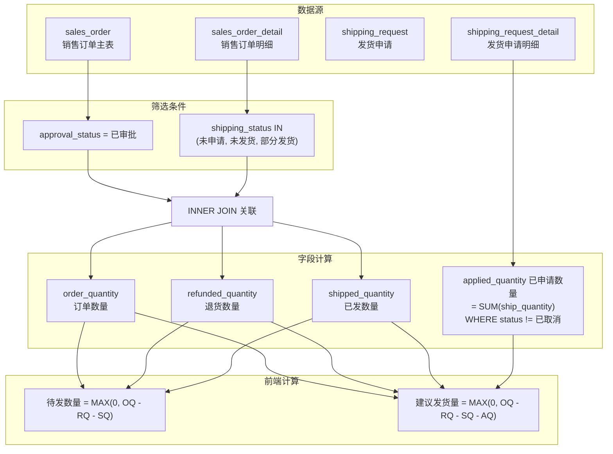
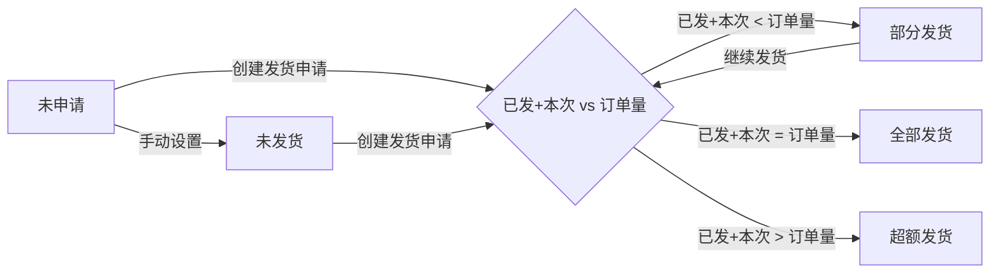
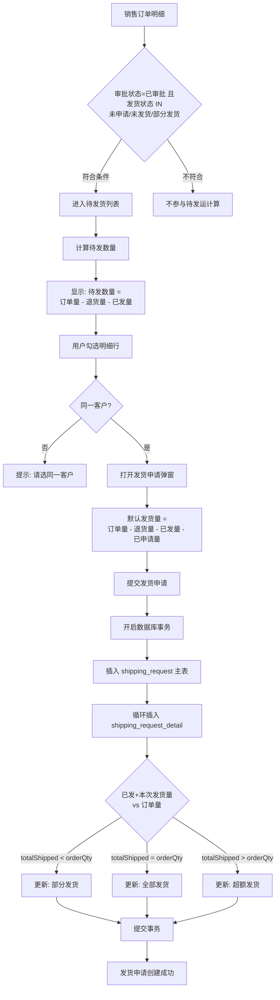

# 销售管理 — 待发运计算逻辑流程图

## 核心公式

待发运数量在两个业务场景中使用了不同粒度的计算：

### 待发货列表显示（不含已申请未发货量）

```
待发数量 = MAX(0, 订单数量 - 退货数量 - 已发数量)
```

### 发货申请默认填充数量（扣减已申请量）

```
建议发货数量 = MAX(0, 订单数量 - 退货数量 - 已发数量 - 已申请数量)
```

> **说明**：`已申请数量`（applied_quantity）由后端子查询实时计算，等于所有未取消发货申请中该明细行的 `ship_quantity` 之和。

---

## 数据来源流程图



---

## 发货状态流转图



### 状态判定逻辑（后端）

```typescript
const totalShipped = alreadyShipped + shipQty;

let newShippingStatus = '部分发货';
if (totalShipped >= orderQty) {
  newShippingStatus = totalShipped > orderQty ? '超额发货' : '全部发货';
}
```

---

## 完整业务流程图



---

## 涉及的数据表

| 表名 | 角色 | 关键字段 |
|------|------|---------|
| `sales_order` | 销售订单主表 | `sales_order_number`, `approval_status`, `customer_number`, `customer_name` |
| `sales_order_detail` | 销售订单明细 | `order_quantity`, `shipped_quantity`, `refunded_quantity`, `shipping_status` |
| `shipping_request` | 发货申请主表 | `request_number`, `status`（待审核/已审核/已发货/已取消） |
| `shipping_request_detail` | 发货申请明细 | `sales_detail_id`, `ship_quantity` |

---

## 关键代码位置

| 环节 | 文件 | 说明 |
|------|------|------|
| 后端待发货查询 | `server/src/modules/sales/shippingRequest/shippingRequest.controller.ts` L27-72 | 查询 `shipping_status IN ('未申请','未发货','部分发货')` + 子查询计算 `applied_quantity` |
| 前端待发数量渲染 | `client/src/views/sales/ShippingRequest/Pending.vue` L231-232 | `MAX(0, order_quantity - refunded_quantity - shipped_quantity)` |
| 前端建议发货量 | `client/src/views/sales/ShippingRequest/Pending.vue` L124-127 | `MAX(0, order_quantity - refunded_quantity - shipped_quantity - applied_quantity)` |
| 发货状态回写 | `server/src/modules/sales/shippingRequest/shippingRequest.controller.ts` L134-151 | `totalShipped = alreadyShipped + shipQty` 判断部分/全部/超额发货 |
| MPS同源筛选 | `server/src/modules/planning/mps/mps.controller.ts` L288-298 | 使用相同 `shipping_status IN (...)` 条件筛选未完成发货的订单明细 |
