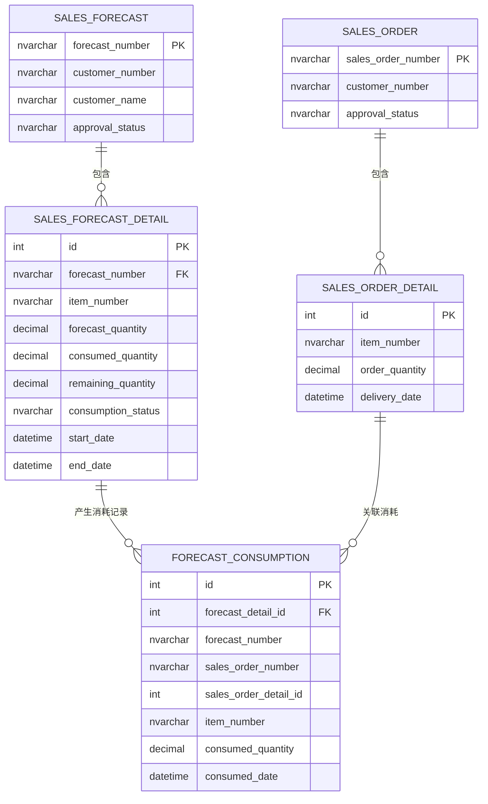
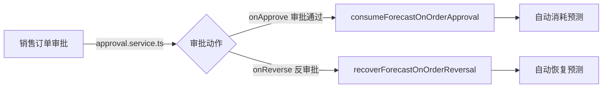
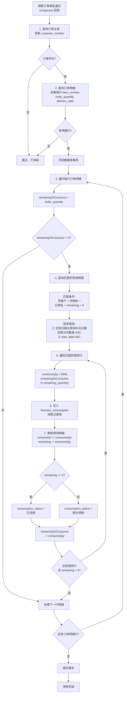
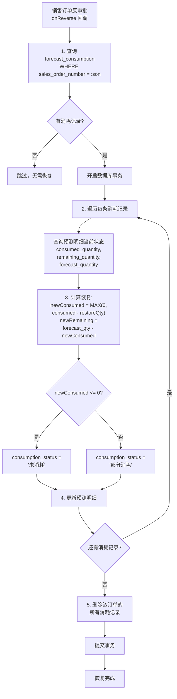
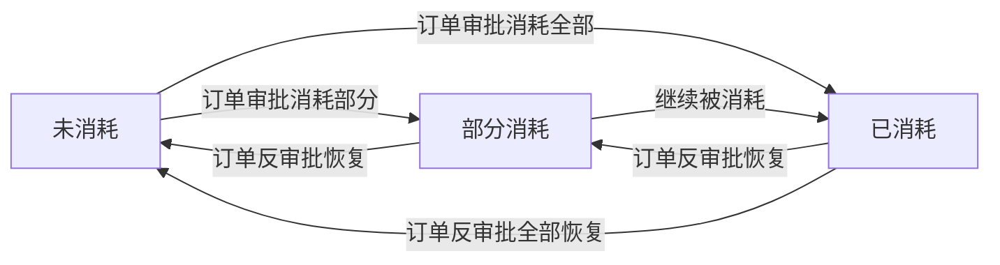

# 销售管理 — 销售预测消耗逻辑流程图

## 概述

销售预测消耗是指：当**销售订单审批通过**时，系统自动将订单数量按"贪心就近优先"算法分配消耗到匹配的预测明细上；当**订单反审批**时，自动恢复已消耗的预测数量。整个过程由审批回调机制自动触发，无需人工干预。

---

## 核心公式

```
消耗数量 = MIN(订单行剩余待消耗数量, 预测行剩余可用数量)
```

```
预测剩余 = forecast_quantity - consumed_quantity
```

```
消耗状态 = remaining_quantity <= 0 ? '已消耗' : '部分消耗'
```

---

## 数据模型



---

## 触发机制



> 注册位置：`approval.service.ts` 第 149 行
> ```typescript
> registerApprovalHandler('sales_order', {
>   onApprove: consumeForecastOnOrderApproval,
>   onReverse: recoverForecastOnOrderReversal
> });
> ```

---

## 预测消耗完整流程图（订单审批触发）



---

## 预测恢复流程图（订单反审批触发）



---

## 消耗匹配算法详解

### 贪心就近优先（Greedy Nearest-First）

对每一行订单明细，系统查找所有符合条件的预测明细行，排序规则为：

1. **时间接近度优先**：预测时间窗口中点与订单交货日期的绝对天数差升序
2. **开始日期优先**：相同接近度时，start_date 较早的优先

```sql
ORDER BY ABS(DATEDIFF(DAY, :delivery_date,
    DATEADD(DAY, DATEDIFF(DAY, fd.start_date, fd.end_date) / 2, fd.start_date))) ASC,
  fd.start_date ASC
```

### 消耗示例

| 订单明细 | 订单量 | 预测A (剩余30) | 预测B (剩余50) | 预测C (剩余20) |
|---------|--------|---------------|---------------|---------------|
| 行1: 物料X, 60件 | 60 | 消耗30 → 已消耗 | 消耗30 → 部分消耗 | 不消耗 |
| 行2: 物料X, 25件 | 25 | — | 消耗20 → 已消耗 | 消耗5 → 部分消耗 |

---

## 消耗状态流转



---

## MPS联动

MPS（主生产计划）计算时，使用预测的 `remaining_quantity`（剩余未消耗数量）作为预测需求：

```sql
SELECT fd.item_number, SUM(fd.remaining_quantity) AS forecast_demand
FROM sales_forecast_detail fd
INNER JOIN sales_forecast f ON f.forecast_number = fd.forecast_number
WHERE f.approval_status = N'已审批' AND fd.remaining_quantity > 0
```

MPS导入生产计划后，还会更新预测明细的 `status` 为"计划中"。

---

## 涉及的数据表

| 表名 | 角色 | 关键字段 |
|------|------|---------|
| `sales_forecast` | 预测主表 | `forecast_number`, `customer_number`, `approval_status` |
| `sales_forecast_detail` | 预测明细 | `forecast_quantity`, `consumed_quantity`, `remaining_quantity`, `consumption_status` |
| `forecast_consumption` | 消耗记录 | `forecast_detail_id`, `sales_order_number`, `sales_order_detail_id`, `consumed_quantity` |
| `sales_order` | 订单主表 | `sales_order_number`, `customer_number` |
| `sales_order_detail` | 订单明细 | `item_number`, `order_quantity`, `delivery_date` |

---

## 关键代码位置

| 环节 | 文件 | 说明 |
|------|------|------|
| 消耗服务函数 | `server/src/services/forecast.service.ts` L19-99 | `consumeForecastOnOrderApproval` 贪心就近优先消耗算法 |
| 恢复服务函数 | `server/src/services/forecast.service.ts` L103-141 | `recoverForecastOnOrderReversal` 逐条恢复+删除消耗记录 |
| 审批回调注册 | `server/src/services/approval.service.ts` L149 | `registerApprovalHandler('sales_order', ...)` |
| 预测创建 | `server/src/modules/sales/forecast/forecast.controller.ts` L111-145 | 初始化 `remaining_quantity = forecast_quantity`, `consumption_status = '未消耗'` |
| 消耗记录查看 | `server/src/modules/sales/forecast/forecast.controller.ts` L253-265 | `getForecastConsumptionLog` 前端查看消耗历史 |
| MPS联动 | `server/src/modules/planning/mps/mps.controller.ts` L11-32 | 使用 `remaining_quantity > 0` 筛选预测需求 |
